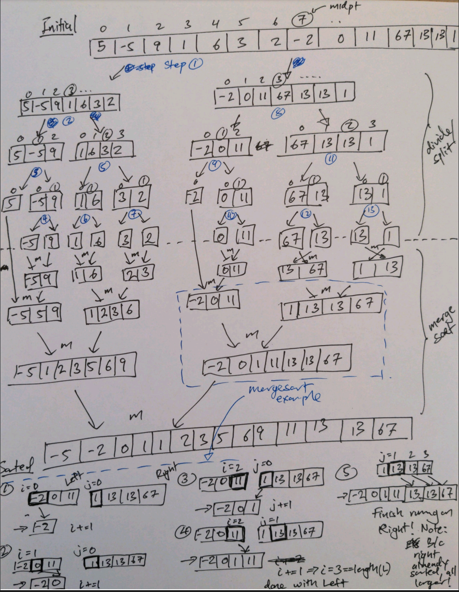

# Recursion
Implements two recursive algorithms with `ruby` for: 
1. the $n^{th}$ fibonnaci sequence, and
2. sorting an array of numbers using the merge sort algorithm.

### Fibbonacci Numbers
A fibbonaci sequence is one comprised of fibbonaci numbers where $f(n) = f(n-1) + f(n-2)$ for $n > 2$, e.g.:

f(1) f(2) f(3) f(4) f(5) f(6) f(7) f(8)

0,   1,   1,   2,   3,   5,   8,   13...

**Non-recursive Form**
```ruby
def fibs(num, result = [0, 1])
  (2..num - 1).each { |i| result << result[i - 1] + result[i - 2] }
  result
end
```

**Recursive Form**
```ruby
def fibs_rec(num)
  return [0] if num <= 1
  return [0, 1] if num == 2

  result = fibs_rec(num - 1)
  result << result[-2] + result[-1]
end

p fibs_rec(8)   # => [0, 1, 1, 2, 3, 5, 8, 13]
```

### Merge Sort
The algorithm works by using a divide and conquer approach. Given an array, the array is sub-divided repeatedly into `left` and `right` halves until each sub-array is precisely *one element*. The process can be envisioned as a *branching tree*. 

Once all sub-arrays are of length 1, the individual sub-arrays (tip of the tree) are then repeatedly merged/coalesced into new larger *sorted* sub-arrays.

In the code implementation, the first `while` loop is used to compare elements one-by-one from the `left` and `right` arrays. Once all elements from either the `left` or `right` arrays have been exhausted, it is no longer necessary to compare the two. Since both `left` and `right` halves are already sorted, the remaining elements are guaranteed to be larger, and thus only need to be appended to the return array. 

A detailed example and sketch is shown below. Refer to the file `detail` for example logs during the divide and merge sort steps.


**Recursive Form**
```ruby
def merge_sort(arr)
  return unless arr.length > 1

  mid = arr.length / 2

  left = arr[0..mid - 1]
  right = arr[mid..]

  merge_sort(left)
  merge_sort(right)

  merge(arr, left, right)
end

def merge(arr, left, right)
  i = j = k = 0

  while i < left.length && j < right.length
    if left[i] < right[j]
      arr[k] = left[i]
      i += 1
    else
      arr[k] = right[j]
      j += 1
    end
    k += 1
  end

  while i < left.length
    arr[k] = left[i]
    i += 1
    k += 1
  end

  while j < right.length
    arr[k] = right[j]
    j += 1
    k += 1
  end
  arr
end

arr = [5, -5, 9, 1, 6, 3, 2, -2, 0, 11, 67, 13, 13, 1]
p merge_sort(arr) # => [-5, -2, 0, 1, 1, 2, 3, 5, 6, 9, 11, 13, 13, 67]
```
